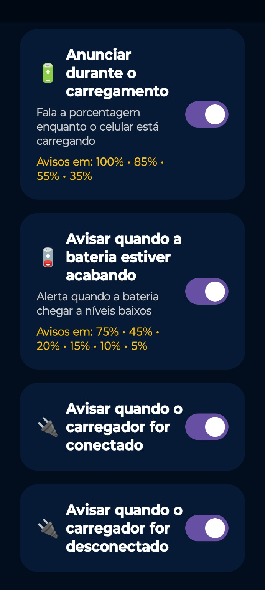
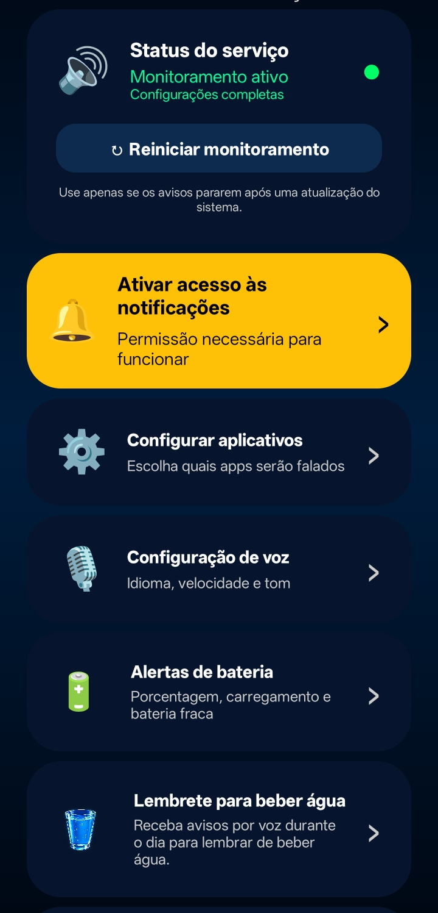
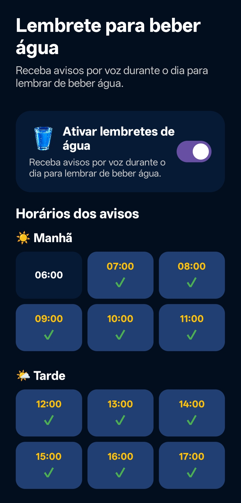

# AlertaPorVoz 🔊

**Native Android application built with Kotlin and Jetpack Compose.**

AlertaPorVoz is an Android application designed to provide **voice-based notification awareness and customizable device alerts**, with a strong focus on background execution, accessibility and practical day-to-day use.

This repository currently serves as a **project showcase and technical portfolio**. The commercial application source code is not publicly available.

## 📸 App Screenshots

  
  
  
  
  

## 📱 Main Features

* Voice announcement of Android notifications
* Text-to-Speech (TTS) integration
* Custom voice selection
* Adjustable speech speed and pitch
* Battery level voice alerts
* Charging status announcements
* Custom scheduled reminders
* Background task execution
* Automatic task restoration after device restart
* Persistent user preferences
* Android runtime permission management
* Multilingual support
* Compatibility testing across different Android manufacturers

## 🛠️ Technologies

* **Kotlin**
* **Jetpack Compose**
* **Android Studio**
* **Android SDK**
* **Notification Listener Service**
* **Text-to-Speech API**
* **Broadcast Receivers**
* **Background Services**
* **Local Data Persistence**
* **Android Permission APIs**
* **Google Play Console**

## ⚙️ Technical Challenges

Development of AlertaPorVoz involved solving several real-world Android challenges, including:

* Maintaining functionality while the application is running in the background
* Handling battery optimization restrictions
* Managing notification access permissions
* Restoring scheduled functionality after device reboot
* Supporting different Android versions
* Handling manufacturer-specific behavior
* Testing background execution across multiple physical devices
* Managing persistent user settings
* Implementing multilingual voice functionality

## 🧪 Device Testing

The application has been tested on multiple real Android devices and manufacturers to identify differences in:

* Background execution
* Battery optimization
* Notification behavior
* Text-to-Speech behavior
* Manufacturer-specific Android restrictions

Testing on physical devices has been an important part of the development and debugging process.

## 🌍 Internationalization

The application includes multilingual support and localized voice announcements.

Currently implemented languages include:

* Portuguese
* English
* Spanish
* Italian

## 🚀 Development Process

The project is continuously improved through:

* Feature implementation
* Real-device testing
* Logcat debugging
* User-interface improvements
* Compatibility analysis
* Bug investigation and correction
* AI-assisted development and technical research
* Validation of implemented solutions before release

## 📌 Project Status

**Active development**

The application is being continuously improved with new features, compatibility enhancements and usability refinements.

## 🔒 Source Code

This repository is currently intended as a **technical portfolio and project showcase**.

The complete production source code is private.

## 👨‍💻 Developer

**Cleber Rusian**

Android Developer
Kotlin • Jetpack Compose • Mobile Apps
